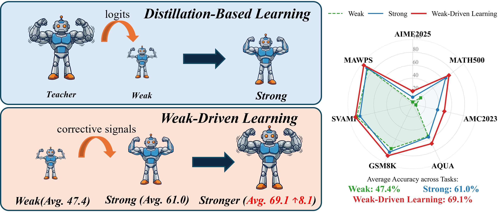
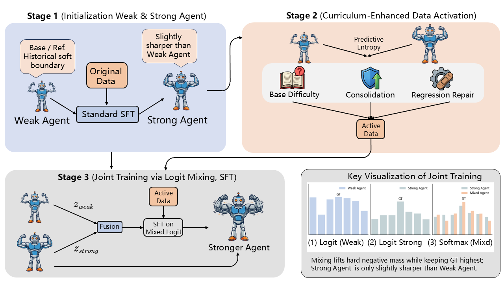
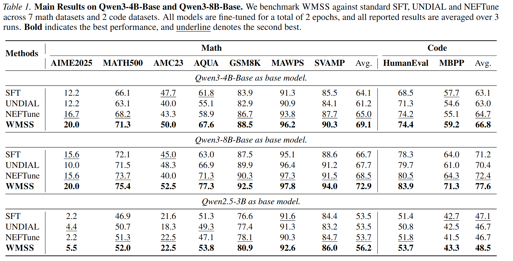

# Weak-Driven Learning

## Update Log
- **2026-02-01**：Update Code 

**Weak Agents can Make Strong Agents Stronger (WAMSAS)**

Weak-Driven Learning is a novel post-training paradigm that challenges the conventional assumption that learning with weaker models necessarily degrades performance. Instead, we show that weak agents (such as historical model checkpoints) can provide informative error signals that continue to drive improvement even when standard supervision saturates.

## Overview

The dominant post-training paradigms, including Supervised Fine-Tuning (SFT), Knowledge Distillation (KD), and Curriculum Learning, share a common principle: learning from stronger supervision signals. While highly effective during early training, such paradigms increasingly suffer from **performance saturation** as optimization proceeds. Specifically, the logit margin—the gap between the target logit and average non-target logits—grows rapidly in early epochs but stabilizes thereafter. Once this margin saturates, gradients induced by standard supervised objectives diminish, limiting further improvement.

**Weak-Driven Learning** approaches this challenge from a fundamentally different perspective. Inspired by human collaborative problem-solving, where a strong individual working alongside a weaker teammate is often forced to further refine their reasoning by observing and correcting the weaker teammate's mistakes, we formalize the principle that **weak agents can make strong agents stronger**.

Unlike knowledge distillation, which depends on access to a stronger teacher that is often expensive or unavailable, weak-driven learning leverages weak reference models that are easy to obtain, such as historical checkpoints of the model itself. By explicitly identifying and distancing the strong model from weak model failure modes, learning can continue beyond the saturation point of standard supervision.

### Key Contributions

- **Learning Paradigm**: We introduce *Weak-Driven Learning*, a new post-training paradigm that highlights the overlooked role of weak agents—such as historical model checkpoints—as driving signals that can further improve strong agents.

- **Training Framework**: We propose a practical post-training framework that operationalizes weak-driven learning through joint optimization of weak and strong models via logit mixing. This mechanism compels the strong model to refine its decision boundary and sustain meaningful gradients in saturated regimes, **without additional inference overhead**.

- **Theoretical Analysis**: We provide a gradient-level analysis of the joint training mechanism, theoretically demonstrating how incorporating weak-model logits reshapes the optimization landscape, prevents gradient vanishing on non-target tokens, and maintains effective learning pressure beyond standard supervision.

- **Empirical Performance**: We empirically demonstrate consistent improvements on challenging benchmarks, including mathematical reasoning and code generation, compared to standard SFT baselines.

## Framework Overview

The following diagram illustrates the paradigm comparison between Distillation-Based Learning and Weak-Driven Learning:

<p align="center">
  
</p>

## Method

Our framework has three phases:

1. **Initialization**: Prepare the base model and initial training data
2. **Activate SFT Data via Curriculum Learning**: Train the first-stage model using entropy-based weighted sampling to focus on challenging samples
3. **Joint Training**: Jointly train weak and strong models through logit mixing to obtain a stronger model

The right panel of the following figure visualizes the joint-training principle through logit mixing and gradient amplification:

<p align="center">
  
</p>

## Quick Start

### Prerequisites

- Python >= 3.8
- CUDA-capable GPUs (recommended: 8 GPUs for full pipeline)
- Conda environment (recommended)

### Installation

1. **Clone the repository**

```bash
git clone https://github.com/chenzehao82/Weak-Driven-Learning.git
cd Weak-Driven-Learning
```

2. **Set up the environment**

```bash
# Create conda environment (example)
conda create -n weak_driven python=3.10
conda activate weak_driven

# Install all dependencies from requirements.txt
pip install -r requirements.txt
```

3. **Configure training parameters**

Edit `scripts/run_ensemble.sh` and modify:
- `GPU_USE`: GPU device IDs (e.g., `0,1,2,3,4,5,6,7`)
- `base_model`: Base model path (e.g., `Qwen/Qwen3-4B-Base`)
- `stage1_data_path`: Path to Stage 1 training data (JSONL format)
- `data_files`: Path to training data for subsequent stages
- `outdir`: Output directory for checkpoints
- Training hyperparameters (epochs, batch size, gradient accumulation, max sequence length, etc.)

4. **Run the complete pipeline**

```bash
# Important: Run from project root directory
cd "/path/to/Weak-Driven-Learning"
bash scripts/run_ensemble.sh
```

The script will automatically execute the three-phase training pipeline:
- Phase 1: Initialize base model and compute initial entropy
- Phase 2: Train first-stage model with curriculum learning (entropy-weighted sampling)
- Phase 3: Jointly train weak and strong models, then extract the enhanced sub-model

## Training Pipeline

The complete pipeline consists of the following steps:

### Phase 1: Initialization

**Step 0: Compute Base Model Entropy**
- Computes `entropy_0` for the base model on the training dataset
- The base model serves as the "weak agent" in subsequent joint training

### Phase 2: Curriculum Learning with Entropy-Weighted Sampling

**Step 1: Stage 1 Training**
- Trains the first sub-model `m1` using the base model and Stage 1 training data
- Output: `$outdir/stage1_m1`
- This model will serve as the "strong agent" in joint training

**Step 2: Compute Stage 1 Entropy**
- Computes `entropy_1` for the Stage 1 model
- Entropy differences identify challenging samples for focused training

**Step 3: Merge Entropy Files**
- Combines `entropy_0` and `entropy_1` → `entropy_merged_stage1.jsonl`
- Used for entropy-based weighted sampling in subsequent stages

**Step 4: Prepare Base Model for Joint Training**
- Copies the base model to `$outdir/stage0_m0` for ensemble fusion
- This weak model checkpoint will be used in joint training

### Phase 3: Joint Training of Weak and Strong Models

**Step 5: Stage 3 Training (Joint Training)**
- Fuses `m0` (weak) + `m1` (strong) and continues training with entropy-weighted sampling
- Implements logit mixing to compel the strong model to refine its decision boundary
- The joint training mechanism prevents gradient vanishing and maintains learning pressure
- Output: Final ensemble model with enhanced capabilities

**Step 6: Extract Enhanced Sub-model**
- Extracts the first sub-model (`submodel_idx=0`) from the ensemble model
- This sub-model contains the enhanced capabilities learned through weak-driven learning
- **No additional inference cost**: The extracted model has the same architecture as the base model

**Step 7: Evaluation**
- Evaluates the extracted model using `eval_vllm_thinking_math.py` on reasoning tasks
- Compares performance against standard SFT baselines

## Project Structure

```
Weak-Driven-Learning/
├── scripts/              # One-command pipeline scripts (entry point)
│   └── run_ensemble.sh  # Complete training pipeline
├── ensemble/             # Core training, entropy computation, extraction, and evaluation
│   ├── ensemble_train.py      # Main training script implementing joint training
│   ├── run_entropy.py         # Entropy computation for curriculum learning
│   ├── extract_submodel.py    # Extract enhanced sub-model from ensemble
│   ├── copymodel.py           # Model copying utility
│   └── eval_vllm_thinking_math.py  # Evaluation script
├── utils/                # Model loading, fusion, entropy computation, data processing
│   ├── utils.py          # Model and data loading utilities
│   ├── fuse_models.py    # Logit mixing and model fusion (WMSS)
│   ├── compute_entropy.py     # Entropy computation algorithms
│   ├── weight_datasets.py     # Entropy-based weighted sampling (BrownBoost-style)
│   └── load_dataset.py    # Dataset loading utilities
├── Trainer/              # SFT training runners and trainers
│   ├── sft_runner.py     # Distributed training runner
│   ├── sft_trainer.py    # Base SFT trainer
│   └── ensemble_sft_trainer.py  # Joint training trainer with logit mixing
├── EnsembleQwen3/        # Qwen3 ensemble model definitions
│   ├── configuration_qwen3.py
│   └── modeling_qwen3.py
├── docs/                 # Additional documentation
├── pics/                 # Figures and diagrams
│   ├── weak-drivenlearning.png  # Paradigm comparison diagram
│   ├── 绘图.png                 # Method overview (three phases + logit mixing)
│   └── 结果图.png              # Evaluation results
├── weights/              # Model checkpoints (generated, gitignored)
├── logs/                 # Training logs (generated, gitignored)
├── tensorboard_logs/     # TensorBoard logs (generated, gitignored)
├── LICENSE
├── README.md
├── QUICKSTART.md
└── SETUP.md
```

## Modular System Design

Weak-Driven Learning is implemented as a modular system with clear separation of concerns:

### Core Modules

1. **Joint Training Module** (`ensemble/ensemble_train.py`, `Trainer/ensemble_sft_trainer.py`)
   - Implements the three-phase training pipeline
   - Manages logit mixing between weak and strong models
   - Coordinates joint optimization to prevent gradient vanishing

2. **Entropy Computation Module** (`utils/compute_entropy.py`, `ensemble/run_entropy.py`)
   - Computes entropy for models at different stages
   - Identifies challenging samples for curriculum learning
   - Merges entropy files for weighted sampling

3. **Model Fusion Module** (`utils/fuse_models.py`)
   - Implements logit mixing mechanism
   - Handles ensemble model creation and sub-model extraction
   - Manages model checkpointing

4. **Weighted Sampling Module** (`utils/weight_datasets.py`)
   - Implements entropy-based weighted sampling (BrownBoost-style)
   - Focuses training on samples where weak and strong models disagree
   - Supports curriculum learning in Phase 2

5. **Training Runner** (`Trainer/sft_runner.py`)
   - Handles distributed training with DeepSpeed
   - Manages training loops and optimization
   - Supports gradient accumulation and mixed precision

6. **Evaluation Module** (`ensemble/eval_vllm_thinking_math.py`)
   - Evaluates models on reasoning tasks
   - Uses vLLM for efficient inference
   - Outputs results to `results/` directory

## Evaluation Results

Evaluation results are saved to the `results/` directory (if configured in the evaluation script). Training logs are written to `logs/`.

Our method consistently improves performance on challenging benchmarks, including mathematical reasoning and code generation, compared to standard SFT baselines. These gains arise purely from improved optimization dynamics during training and incur **no additional inference cost**.

Example results visualization:

<p align="center">
  
</p>

## Theoretical Insights

Our gradient-level analysis demonstrates that:

1. **Gradient Reshaping**: Incorporating weak-model logits reshapes the optimization landscape, preventing gradient vanishing on non-target tokens.

2. **Sustained Learning Pressure**: The joint training mechanism maintains effective learning pressure beyond standard supervision saturation.

3. **No Inference Overhead**: The extracted enhanced sub-model has the same architecture as the base model, requiring no additional computational cost during inference.

## Acknowledgments

- Model architecture based on Qwen models
- Training framework built on TRL and Hugging Face Transformers
- Project organization inspired by [RAGEN](https://github.com/mll-lab-nu/RAGEN)

## License

This project is licensed under the MIT License - see the [LICENSE](LICENSE) file for details.

