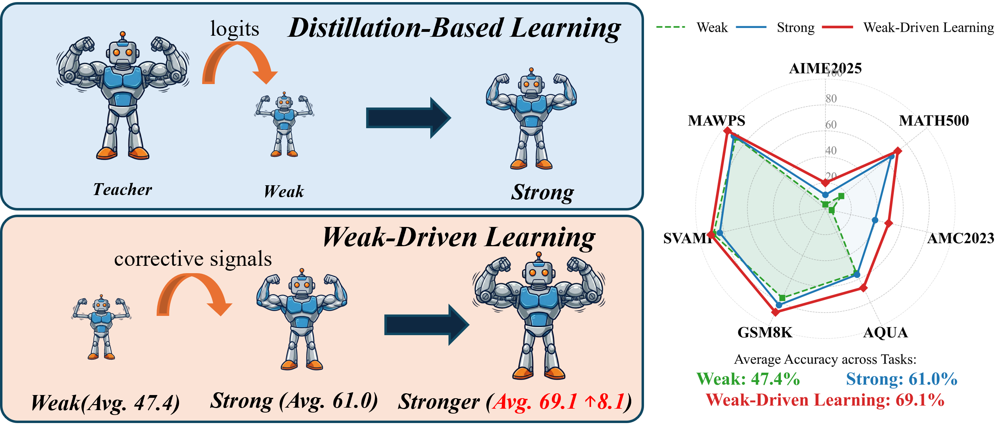
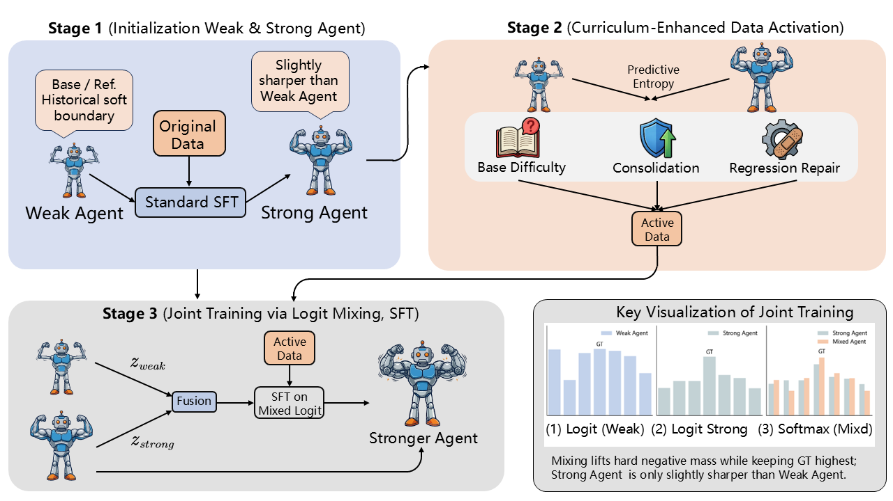
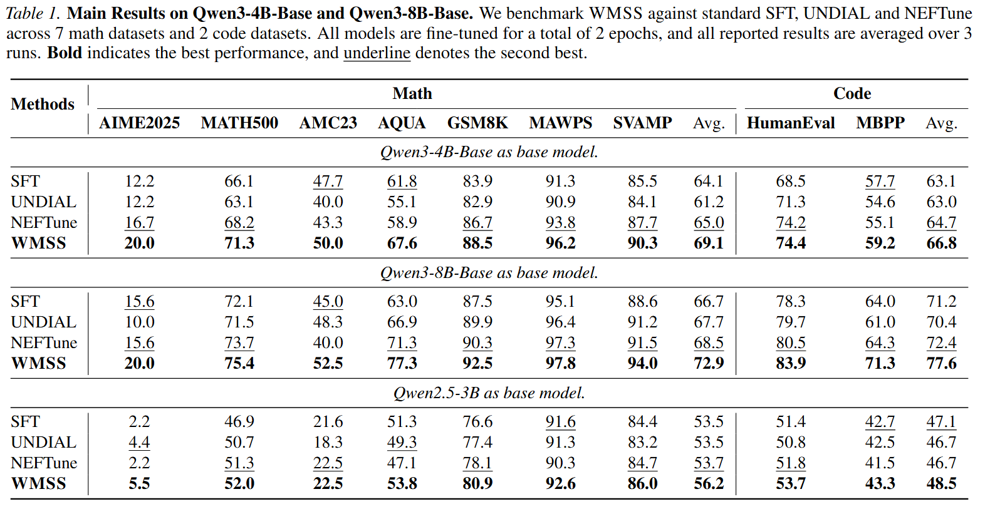

<h1 align="center">Weak-Driven Learning</h1>

<p align="center"></p>

<p align="center">
  <a href="https://arxiv.org/abs/2602.08222"></a>
  <a href="https://huggingface.co/papers/2602.08222"></a>
  <a href="https://huggingface.co/chhao/Weak-Driven-Learning"></a>
  <a href="https://zhuanlan.zhihu.com/p/2005771197502231775"></a>
  <a href="http://xhslink.com/o/4RYFUzqCHSj"></a>
</p>

## Update Log
- **2026-02-01**：Update Code 

**Weak Agents can Make Strong Agents Stronger (WMSS)**

Weak-Driven Learning is a novel post-training paradigm that challenges the conventional assumption that learning with weaker models necessarily degrades performance. Instead, we show that weak agents (such as historical model checkpoints) can provide informative error signals that continue to drive improvement even when standard supervision saturates.

## Overview

The dominant post-training paradigms, including Supervised Fine-Tuning (SFT), Knowledge Distillation (KD), and Curriculum Learning, share a common principle: learning from stronger supervision signals. While highly effective during early training, such paradigms increasingly suffer from **performance saturation** as optimization proceeds. Specifically, the logit margin—the gap between the target logit and average non-target logits—grows rapidly in early epochs but stabilizes thereafter. Once this margin saturates, gradients induced by standard supervised objectives diminish, limiting further improvement.

**Weak-Driven Learning** approaches this challenge from a fundamentally different perspective. Inspired by human collaborative problem-solving, where a strong individual working alongside a weaker teammate is often forced to further refine their reasoning by observing and correcting the weaker teammate's mistakes, we formalize the principle that **weak agents can make strong agents stronger**.

Unlike knowledge distillation, which depends on access to a stronger teacher that is often expensive or unavailable, weak-driven learning leverages weak reference models that are easy to obtain, such as historical checkpoints of the model itself. By explicitly identifying and distancing the strong model from weak model failure modes, learning can continue beyond the saturation point of standard supervision.

### Key Contributions

- **Learning Paradigm**: We introduce *Weak-Driven Learning*, a new post-training paradigm that highlights the overlooked role of weak agents—such as historical model checkpoints—as driving signals that can further improve strong agents.

- **Training Framework**: We propose a practical post-training framework that operationalizes weak-driven learning through joint optimization of weak and strong models via logit mixing. This mechanism compels the strong model to refine its decision boundary and sustain meaningful gradients in saturated regimes, **without additional inference overhead**.

- **Theoretical Analysis**: We provide a gradient-level analysis of the joint training mechanism, theoretically demonstrating how incorporating weak-model logits reshapes the optimization landscape, prevents gradient vanishing on non-target tokens, and maintains effective learning pressure beyond standard supervision.

- **Empirical Performance**: We empirically demonstrate consistent improvements on challenging benchmarks, including mathematical reasoning and code generation, compared to standard SFT baselines.

## Framework Overview

The following diagram illustrates the paradigm comparison between Distillation-Based Learning and Weak-Driven Learning:

<p align="center">
  
</p>

## Method

Our framework has three phases:

1. **Initialization**: Prepare the base model and initial training data
2. **Activate SFT Data via Curriculum Learning**: Train the first-stage model using entropy-based weighted sampling to focus on challenging samples
3. **Joint Training**: Jointly train weak and strong models through logit mixing to obtain a stronger model

The right panel of the following figure visualizes the joint-training principle through logit mixing and gradient amplification:

<p align="center">
  
</p>

## Quick Start

### Prerequisites

- Python >= 3.10
- CUDA-capable GPUs (recommended: 8 GPUs for full pipeline)
- Conda environment (recommended)

### Installation

1. **Clone the repository**

```bash
git clone https://github.com/chenzehao82/Weak-Driven-Learning.git
cd Weak-Driven-Learning
```

2. **Set up the environment**

```bash
# Create conda environment (example)
conda create -n weak_driven python=3.10
conda activate weak_driven

# Install all dependencies from requirements.txt
pip install -r requirements.txt
```

3. **Prepare training data (AM-DeepSeek-R1 Distilled)**

We provide a data processing script to filter and reformat the AM-DeepSeek-R1-Distilled dataset:

```bash
cd dataprocess
python am_deepseek_r1_distilled.py
```

This will generate:
- `am_deepseek_r1_filtered_ad.jsonl` — main training data (with `idx` field)
- `am_deepseek_r1_filtered_ad_test_1000.jsonl` — a 1K-sample test subset

By default, `scripts/run_ensemble.sh` reads
`dataprocess/am_deepseek_r1_filtered_ad.jsonl` from the repository. If the
processed file is stored elsewhere, set `TRAIN_DATA_PATH` before launching the
pipeline:

```bash
export TRAIN_DATA_PATH=/path/to/am_deepseek_r1_filtered_ad.jsonl
```

4. **Configure training parameters**

Edit `scripts/run_ensemble.sh` and modify:
- `GPU_USE`: GPU device IDs (e.g., `0,1,2,3,4,5,6,7`)
- `base_model`: Base model path (e.g., `Qwen/Qwen3-4B-Base`)
- `outdir`: Output directory for checkpoints
- Training hyperparameters (epochs, batch size, gradient accumulation, max sequence length, etc.)

5. **Run the complete pipeline**

```bash
# Important: Run from project root directory
cd "/path/to/Weak-Driven-Learning"
bash scripts/run_ensemble.sh
```

The script will automatically execute the three-phase training pipeline:
- Phase 1: Initialize base model and compute initial entropy
- Phase 2: Train first-stage model with curriculum learning (entropy-weighted sampling)
- Phase 3: Jointly train weak and strong models, then extract the enhanced sub-model

## Training Pipeline

The complete pipeline consists of the following steps:

### Phase 1: Initialization

**Step 0: Compute Base Model Entropy**
- Computes `entropy_0` for the base model on the training dataset
- The base model serves as the "weak agent" in subsequent joint training

### Phase 2: Curriculum Learning with Entropy-Weighted Sampling

**Step 1: Stage 1 Training**
- Trains the first sub-model `m1` using the base model and Stage 1 training data
- Output: `$outdir/stage1_m1`
- This model will serve as the "strong agent" in joint training

**Step 2: Compute Stage 1 Entropy**
- Computes `entropy_1` for the Stage 1 model
- Entropy differences identify challenging samples for focused training

**Step 3: Merge Entropy Files**
- Combines `entropy_0` and `entropy_1` → `entropy_merged_stage1.jsonl`
- Used for entropy-based weighted sampling in subsequent stages

**Step 4: Prepare Base Model for Joint Training**
- Copies the base model to `$outdir/stage0_m0` for ensemble fusion
- This weak model checkpoint will be used in joint training

### Phase 3: Joint Training of Weak and Strong Models

**Step 5: Stage 3 Training (Joint Training)**
- Fuses `m0` (weak) + `m1` (strong) and continues training with entropy-weighted sampling
- Implements logit mixing to compel the strong model to refine its decision boundary
- The joint training mechanism prevents gradient vanishing and maintains learning pressure
- Output: Final ensemble model with enhanced capabilities

**Step 6: Extract Enhanced Sub-model**
- Extracts the current/strong branch (`submodel_idx=1`) from the ensemble model;
  in this pipeline index 0 is `stage0_m0` (base/weak) and index 1 is
  `stage1_m1` (current/strong)
- This sub-model contains the enhanced capabilities learned through weak-driven learning
- **No additional inference cost**: The extracted model has the same architecture as the base model

**Step 7: Evaluation**
- Evaluates the extracted model using `eval_vllm_thinking_math.py` on reasoning tasks
- Compares performance against standard SFT baselines
- Uses the paper's main evaluation contract by default: thinking enabled,
  seed 42, temperature 0, top-p 1, and one generation per problem

## Standalone Evaluation

The evaluator writes both per-generation predictions and an explicit protocol
summary under the requested output directory. The paper's main evaluation is
greedy decoding: thinking enabled, seed 42, temperature 0, top-p 1, and one
generation per problem. For AIME2025 and AMC23, use an 8K generation budget;
the other mathematical benchmarks use 4K.

| Paper benchmark profile | `--max-input-tokens` | `--max-new-tokens` | `--max-model-len` |
|---|---:|---:|---:|
| AIME2025 / AMC23 | 4096 | 8192 | 12288 |
| Other math benchmarks | 4096 | 4096 | 8192 |

For example, run the main greedy evaluation on AIME2025 from the repository
root:

```bash
python ensemble/eval_vllm_thinking_math.py \
  --dataset dataprocess/test_dataset/aime2025/test.json \
  --model /path/to/model-or-checkpoint \
  --dataset-name aime2025 \
  --tp 1 \
  --mode greedy \
  --temperature 0 \
  --top-p 1 \
  --num-samples 1 \
  --thinking \
  --seed 42 \
  --max-input-tokens 4096 \
  --max-new-tokens 8192 \
  --max-model-len 12288 \
  --output-dir results/my-model/aime2025-greedy
```

To measure pass@8, use eight stochastic generations per problem. The recent
Qwen3 OPD checkpoint runs use the `opd` preset: user-only prompts, thinking
enabled, Qwen end-token validation, temperature 0.5, top-p 1, and seed 42.
They reserve 2K input tokens and 8K output tokens for AIME2025 and AMC23:

```bash
python ensemble/eval_vllm_thinking_math.py \
  --dataset dataprocess/test_dataset/aime2025/test.json \
  --model /path/to/model-or-checkpoint \
  --dataset-name aime2025 \
  --tp 1 \
  --protocol opd \
  --mode passk \
  --temperature 0.5 \
  --top-p 1 \
  --num-samples 8 \
  --thinking \
  --seed 42 \
  --max-input-tokens 2048 \
  --max-new-tokens 8192 \
  --max-model-len 10240 \
  --dataset-sha256 de1b2907208f7e7302825a16af356e5f3782401e9c51150a46d83240e4f3db97 \
  --grader /path/to/OPD/verl/verl/utils/reward_score/ttrl_math/__init__.py \
  --grader-sha256 6e7f8ea703258c051e4c28379443416a485046c235196f4ee25a244c216e994c \
  --output-dir results/my-model/aime2025-pass8-t0.5
```

MATH500 under the same OPD preset uses `4096` new tokens and a total model
length of `5120`. AIME2025 and AMC23 both use `8192` new tokens and a total
model length of `10240`. The external grader arguments make the scoring code
part of the reproducibility contract. The pinned implementation is the
[`ttrl_math` scorer from THUNLP/OPD at commit `4532fd3`](https://github.com/thunlp/OPD/tree/4532fd35ccfdde82adc918b265e4c964534e83d1/verl/verl/utils/reward_score/ttrl_math);
keep its companion Python files in the same directory. Omit the grader only
when intentionally using this repository's public `math-verify` scorer, and
then pass `--allow-public-grader` to make that scorer change explicit. Run
pass@1 separately with
`--mode pass1 --num-samples 1 --temperature 0.1` (or `0.5`); it is not taken
from sample zero of a pass@8 run.

Use `--tp 1` for these contracts. The recent four-GPU runs used four separate
single-GPU workers that sharded problems, rather than tensor-parallelizing one
generation request; `--tp 4` is not an equivalent way to reproduce them.

`mean@n` and `pass@n` are different metrics. `mean@n` is the accuracy averaged
over all `n` generations, while `pass@n` is the fraction of problems for which
at least one of the `n` generations is correct. Repeating greedy decoding at
temperature 0 does not produce a meaningful pass@8; use the stochastic
protocol above.

The repository includes AIME2025, AMC23, AQuA, GSM8K, MAWPS, and SVAMP test
files under `dataprocess/test_dataset/`. It does not bundle Math500. For the
full pipeline, point `EVAL_DATA_ROOT` at an external directory with the same
subdirectory layout, or set `EVAL_MATH500_PATH` directly:

```bash
export EVAL_DATA_ROOT=/path/to/test_dataset
export EVAL_MATH500_PATH=/path/to/math500/test.jsonl
export EVAL_OUTPUT_ROOT="$PWD/results"
bash scripts/run_ensemble.sh
```

## Project Structure

```
Weak-Driven-Learning/
├── scripts/              # One-command pipeline scripts (entry point)
│   └── run_ensemble.sh  # Complete training pipeline
├── ensemble/             # Core training, entropy computation, extraction, and evaluation
│   ├── ensemble_train.py      # Main training script implementing joint training
│   ├── run_entropy.py         # Entropy computation for curriculum learning
│   ├── extract_submodel.py    # Extract enhanced sub-model from ensemble
│   ├── copymodel.py           # Model copying utility
│   └── eval_vllm_thinking_math.py  # Evaluation script
├── dataprocess/          # Data processing scripts
│   └── am_deepseek_r1_distilled.py  # AM-DeepSeek-R1 dataset filtering and formatting
├── utils/                # Model loading, fusion, entropy computation, data processing
│   ├── utils.py          # Model and data loading utilities
│   ├── fuse_models.py    # Logit mixing and model fusion (WMSS)
│   ├── compute_entropy.py     # Entropy computation algorithms
│   ├── weight_datasets.py     # Entropy-based weighted sampling (BrownBoost-style)
│   ├── load_dataset.py   # Dataset loading utilities
│   ├── prompts.py        # Prompt templates
│   ├── run_entropy.py    # Entropy computation runner
│   └── clear_gpu.py      # GPU memory management utility
├── Trainer/              # SFT training runners and trainers
│   └── sft_runner.py     # Distributed training runner
├── EnsembleQwen3/        # Qwen3 ensemble model definitions
│   ├── configuration_qwen3.py  # Model configuration
│   └── modeling_qwen3.py       # Model architecture with logit mixing
├── pics/                 # Figures and diagrams
│   ├── logo.png          # Project logo
│   ├── weak-drivenlearning.png  # Paradigm comparison diagram
│   ├── framework.png     # Method overview (three phases + logit mixing)
│   └── results.png       # Evaluation results
├── requirements.txt      # Python dependencies
└── README.md             # Project documentation
```

## Modular System Design

Weak-Driven Learning is implemented as a modular system with clear separation of concerns:

### Core Modules

1. **Joint Training Module** (`ensemble/ensemble_train.py`)
   - Implements the three-phase training pipeline
   - Manages logit mixing between weak and strong models
   - Coordinates joint optimization to prevent gradient vanishing

2. **Entropy Computation Module** (`utils/compute_entropy.py`, `ensemble/run_entropy.py`)
   - Computes entropy for models at different stages
   - Identifies challenging samples for curriculum learning
   - Merges entropy files for weighted sampling

3. **Model Fusion Module** (`utils/fuse_models.py`)
   - Implements logit mixing mechanism
   - Handles ensemble model creation and sub-model extraction
   - Manages model checkpointing

4. **Weighted Sampling Module** (`utils/weight_datasets.py`)
   - Implements entropy-based weighted sampling (BrownBoost-style)
   - Focuses training on samples where weak and strong models disagree
   - Supports curriculum learning in Phase 2

5. **Training Runner** (`Trainer/sft_runner.py`)
   - Handles distributed training with DeepSpeed
   - Manages training loops and optimization
   - Supports gradient accumulation and mixed precision

6. **Evaluation Module** (`ensemble/eval_vllm_thinking_math.py`)
   - Evaluates models on reasoning tasks
   - Uses vLLM for efficient inference
   - Outputs predictions and protocol metadata to `results/` by default

## Evaluation Results

Evaluation results are saved to the repository's `results/` directory by
default. Override this location with `--output-dir` for a standalone run or
`EVAL_OUTPUT_ROOT` for the full pipeline. Training logs are written to `logs/`.

Our method consistently improves performance on challenging benchmarks, including mathematical reasoning and code generation, compared to standard SFT baselines. These gains arise purely from improved optimization dynamics during training and incur **no additional inference cost**.

Example results visualization:

<p align="center">
  
</p>


## Acknowledgments

- Model architecture based on Qwen models
- Training framework built on TRL and Hugging Face Transformers

## License

This project is licensed under the MIT License - see the [LICENSE](LICENSE) file for details.
